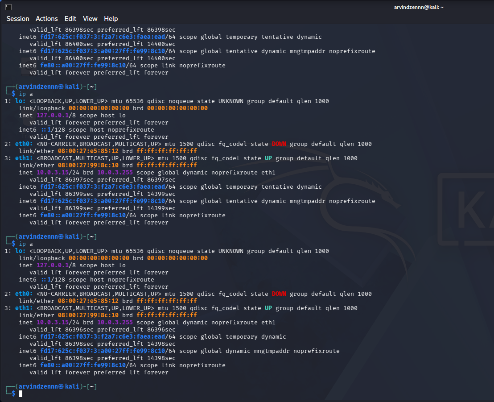
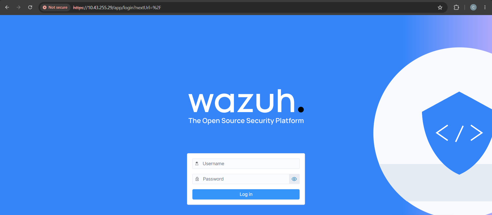
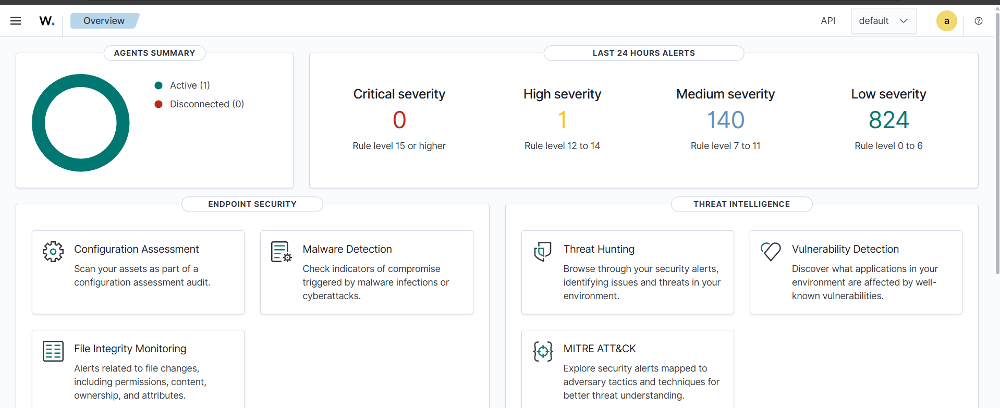
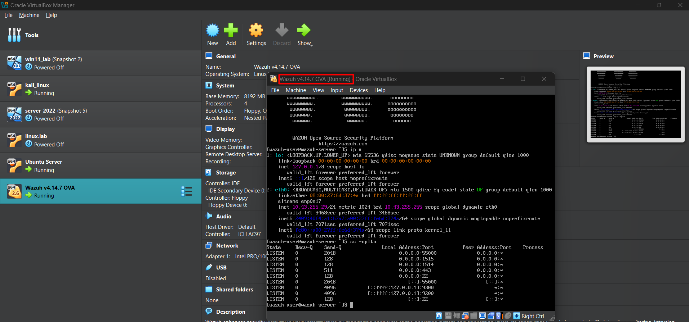

# Wazuh Deployment

## 1. Overview

Wazuh was deployed as the **SIEM and endpoint monitoring platform** for this SOC home lab.

The Wazuh virtual appliance (OVA) was used to simplify the initial deployment. The appliance was imported into **Oracle VirtualBox** and configured as the central Wazuh server responsible for collecting, processing, and analyzing security events generated by the lab endpoints.

The deployment was performed in a controlled virtual lab environment containing the Wazuh server and monitored endpoints.

---

## 2. Lab Environment

| Component         | Purpose                      |
| ----------------- | ---------------------------- |
| Wazuh             | SIEM and security monitoring |
| Oracle VirtualBox | Virtualization platform      |
| Wazuh OVA         | Wazuh server appliance       |
| Ubuntu            | Monitored endpoint           |
| Windows           | Lab environment              |

---

## 3. Wazuh OVA Import

The Wazuh OVA appliance was imported into Oracle VirtualBox.

After importing the appliance, the virtual machine configuration was reviewed to verify:

* Memory allocation
* Virtual disk
* Network adapter
* Virtual hardware configuration
* Network connectivity

The network adapter was configured to allow communication between the Wazuh server and the other systems in the lab network.

### Evidence

> Wazuh OVA successfully imported into Oracle VirtualBox.

**Screenshot:**
`evidence/wazuh/wazuh-ova-imported.png`

---

## 4. Starting the Wazuh Virtual Machine

After completing the OVA import and reviewing the virtual hardware configuration, the Wazuh virtual machine was started.

The VM booted successfully and the Wazuh environment became available.

This confirmed that the Wazuh server appliance was functioning correctly and was ready for the subsequent endpoint-agent deployment stage.

### Evidence

> Wazuh virtual machine running successfully.

**Screenshot:**
`evidence/wazuh/wazuh-vm-running.png`

---

## 5. Deployment Verification

The Wazuh virtual machine was successfully deployed and started in Oracle VirtualBox.

At this stage, the Wazuh server was operational and ready to act as the central monitoring platform for the SOC lab.

The next stage was to configure an Ubuntu endpoint with the **Wazuh Agent** and establish communication with the Wazuh Manager.

---

## 6. Deployment Result

### Status

**Wazuh Server Deployment: Successful**

The Wazuh virtual appliance was successfully imported, started, and prepared for endpoint monitoring.

### Next Step

Proceed to:

**02 — Agent Setup**

The next phase involves installing and configuring the Wazuh Agent on the Ubuntu endpoint and establishing communication with the Wazuh Manager.

---

## Skills Demonstrated

* SIEM deployment
* Virtual machine deployment
* Wazuh administration
* VirtualBox administration
* Network configuration
* Security monitoring infrastructure
* Lab environment design

## Evidence Screenshots

### 1. VirtualBox Wazuh VM

### 2. Wazuh VM Terminal

### 3. Wazuh Login Screen

### 4. Wazuh Dashboard

### 5. Wazuh VM Terminal Evidence

### 6. Additional VM Terminal Evidence

